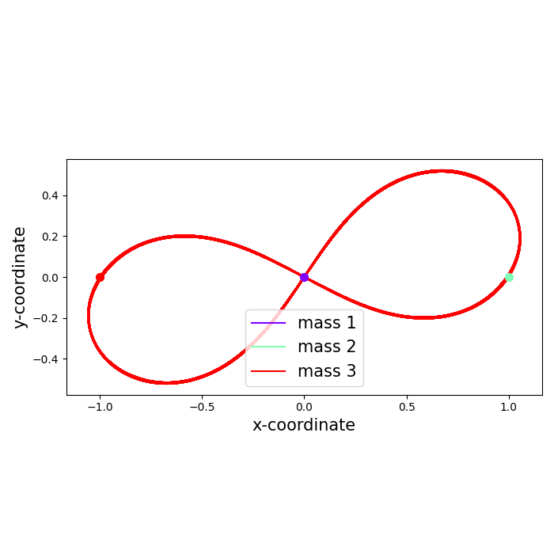

# Stability of Selective Solutions to the 3-Body Problem 
 The general three body problem, which describes three masses interacting freely and purely
 by gravitational attraction, has been a focus of research in classical mechanics for the past 300
 years. Previous analytical work by Euler and Lagrange describes five families of periodic, elliptical, 
 solutions to the problem. Furthermore, modern numerical techniques have unlocked the discovery of many 
 new periodic solutions, such as the distinct ‘figure-8’ orbit. This thesis builds
 a framework for analysing the stability of such orbits, in both the traditional and Lyapunov
 sense. It is confirmed that the figure-8 is stable, and Euler and Lagrange’s circular solutions are
 unstable. A region of stability is found for the figure-8, and the maximum Lyapunov exponents
 of Euler and Lagrange’s solutions are accurately calculated. The implications of the results are
 discussed with reference to Celestial mechanics and the N-body problem


# N-Body Simulation Framework

This repository provides a framework for simulating the N-body problem. Simulations can be run up to time `T` using any one of a number of numerical integration schemes. 

Most useful is the time-adaptive **symplectic integrator** based on the Forest-Ruth algorithm, suitable for general N-body systems.

## Modules

- **`functions.py`**  
  Governing equations for N-body dynamics. Includes functions for computing forces, accelerations, kinetic and potential energy, and angular momentum.

- **`plot.py`**  
  Visualization functions for plotting trajectories, energies, and angular momentum of N-body systems in 2D.

- **`schemes.py`**  
  Implements candidate numerical integrators:  
  Euler, Euler-Cromer, Leapfrog, Runge-Kutta 4, Forest-Ruth, PEFRL, and an optimized Forest-Ruth variant.

- **`Kepler.py`**  
  Analytic solution for 2-body (Kepler) orbits. Useful for validating numerical schemes.

- **`FRSolver.py`**  
  Solves the N-body equations using the fixed-step Forest-Ruth method.

- **`adaptive.py`**  
  Implements time-adaptive integration schemes, including adaptive symplectic methods and RKF45.

## Notes 
This project is designed for my Master's thesis, and not as a well-interpretable, robust package. As a result, many of the notebooks and Scripts have not been optimised, have redundant functionality, and serve to document progression. 

# Quickstart Example
Try running this code in a notebook **`example.ipynb`**: 
```python
from FRSolver import *

# Example: 3-body system
# gravity
G = 1

# masses
m1 = 1
m2 = 1
m3 = 1
masses = np.array([m1, m2, m3])

# position
r1 = np.array([0,0.0,0.0], dtype="float64")
r2 = np.array([1,0.0,0.0], dtype="float64")
r3 = np.array([-1,0.0,0.0], dtype="float64")

# initial momentum
p1 = 0.347111
p2 = 0.532728

# velocity
v1 = np.array([-2 * p1,-2*p2,0], dtype="float64")
v2 = np.array([p1,p2,0], dtype="float64")
v3 = np.array([p1,p2,0], dtype="float64")

# create initial vectors
r0s = np.array([r1,r2,r3])
v0s = np.array([v1,v2,v3])

T = 1000
C = 0.5

# Run simulation using Forest-Ruth integrator
traj, stability = fullSolver(T, C, r0s, v0s, G, masses)

# Plot trajectories and energy/AM evolution
PlotOrbits(traj)
```



# Report
A write-up and full list of citations are found in the pdf '[Stability of Selective Solutions to the 3-Body Problem.pdf](Stability%20of%20Selective%20Solutions%20to%20the%203-Body%20Problem.pdf)'.

# References
- Chenciner, A.; Montgomery, R. “A remarkable periodic solution of the three-body problem in the case of equal masses.” *Annals of Mathematics* **152**, 881–901 (2000).  
- Euler, L. “De motu rectilineo trium corporum se mutuo attrahentium.” *Commentarii academiae scientiarum Petropolitanae* (1767).  
- Lagrange, J.L. “Essai sur le problème des trois corps.” *Oeuvres* (1772).  
- Simo, C. “Dynamical properties of the figure-eight solution of the three-body problem.” *Celestial Mechanics and Dynamical Astronomy* **55**, 127–147 (1993).  
- Forest, E.; Ruth, R.D. “Fourth-order symplectic integration.” *Physica D* **43**, 105–117 (1990).  
- Diacu, F. “Relative equilibria of the three-body problem.” *Celestial Mechanics and Dynamical Astronomy* **63**, 1–20 (1995).  